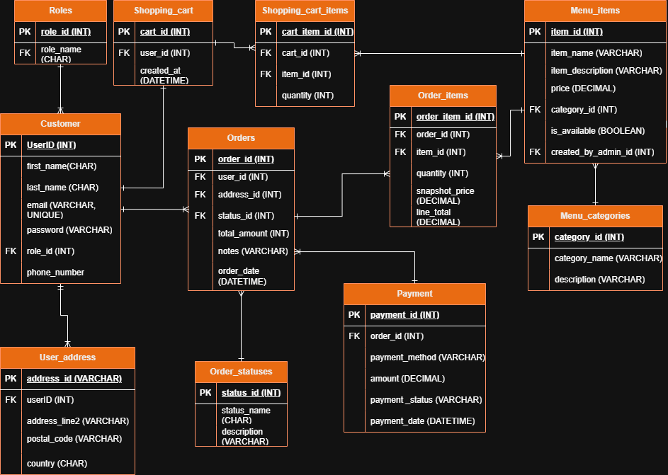

# FoodJS

A full-stack food ordering platform built around a polished customer journey and a practical restaurant administration dashboard.



## Highlights

- Responsive menu discovery, product details, cart, checkout, and order history
- Live order tracking with customer notifications
- Role-based authentication for customers and administrators
- Admin analytics, revenue overview, order management, menu categories, and coupons
- Google OAuth support and optional email notifications
- REST API backed by lightweight JSON persistence for an easy local demo

## Tech stack

- **Frontend:** React 19, React Router, Vite, Framer Motion, Leaflet
- **Backend:** Node.js, Express, JWT, bcrypt, Nodemailer
- **Tooling:** ESLint and npm scripts

## Run locally

Requirements: Node.js 20+ and npm.

```bash
cd FoodJS
npm run install:all
```

Start the API with `npm run dev:backend`. In a second terminal, run `npm run dev:frontend` from the same directory. Open `http://localhost:5173`; the API runs at `http://localhost:3001`.

## Configuration

Create `FoodJS/backend/.env` when enabling integrations:

```env
PORT=3001
JWT_SECRET=replace-with-a-long-random-value
GOOGLE_CLIENT_ID=
GOOGLE_CLIENT_SECRET=
GOOGLE_REDIRECT_URI=http://localhost:5173/auth/callback
SMTP_HOST=
SMTP_PORT=587
SMTP_USER=
SMTP_PASS=
SMTP_FROM=
SMTP_SECURE=false
```

Google OAuth and SMTP are optional for the core local ordering flow. Never commit real credentials.

`DEMO_MODE` defaults to enabled so portfolio visitors can enter any email and password to explore the customer experience. Set `DEMO_MODE=false` to require registered credentials.

Demo administrator access: `admin@foodjs.demo` / `admin123`.

## Project structure

```text
FoodJS/
├── frontend/   React client and admin dashboard
└── backend/    Express API, routes, middleware, and demo data
```

## Quality checks

```bash
cd FoodJS/frontend
npm run lint
npm run build
```

## Deploy a live demo

This repository includes a Render Blueprint that serves the production React build and Express API from one public URL.

1. Push the repository to GitHub.
2. In Render, choose **New → Blueprint**.
3. Connect this repository and apply `render.yaml`.
4. Add the generated `onrender.com` URL to your portfolio as the live demo link.

The free service uses temporary filesystem storage. Demo orders and account changes may reset when the service restarts or redeploys; use a managed database before treating it as a production system.

## License

MIT
